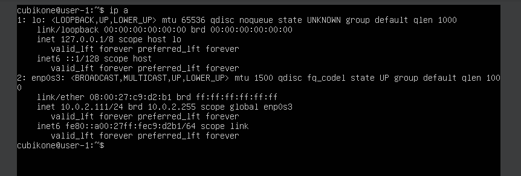
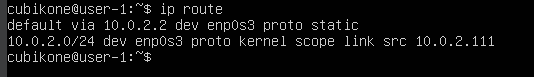
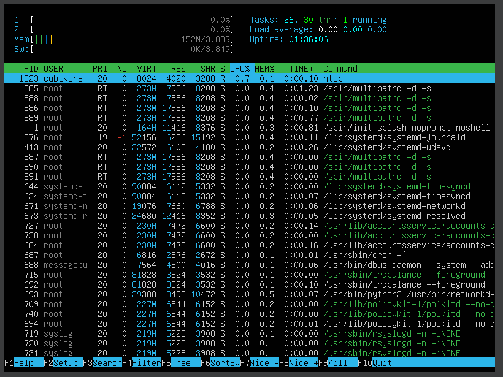
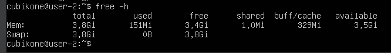

## Part 1. Установка ОС

1. 

## Part 2. Создание пользователя

1. 

2. 

3. 

## Part 3. Настройка сети ОС

1. 

2. 

3. 

4. 

5. 

6. 

7. IO - Это локальный интерфейс, который позволяет программам обращаться к этому компьютеру.

8. 

9. DHCP — это протокол клиента или сервера, который автоматически предоставляет узел протокола IP с его IP-адресом и другие связанные сведения о конфигурации, такие как маска подсети и шлюз по умолчанию.

10. 

11. 

12. 

13. 

14. 

15. 

## Part 4. Обновление ОС

1. 

## Part 5. Использование команды **sudo**

1. 

2. sudo — это утилита, предоставляющая привилегии root для выполнения административных операций в соответствии со своими настройками.

3. 

## Part 6. Установка и настройка службы времени

1. 

## Part 7. Установка и использование текстовых редакторов 

1. 

2. 

3. 

4. 

5. 

6. 

7. 

8. 

9. 

10. 

11. 

12. 

## Part 8. Установка и базовая настройка сервиса **SSHD**

1. sudo apt install openssh-server - установка ssh

2. 

3. 

4. 

5. 

6. t - tcp порты, a - все порты, n - отображение активных TCP-подключений, адреса и номера портов выражаются числовым образом.

7. Значение столбцов:
   - Proto - имя протокола;  
   - Recv-Q - количество байтов, помещённых в буфер приёма;  
   - Send-Q -  количество байтов, помещённых в буфер отправки;  
   - Local Address - IP-адрес локального компьютера и используемого номера порта;  
   - Foreign Address - IP-адрес и номер порта удаленного компьютера, к которому подключен сокет;  
   - State - Указывает состояние TCP-подключения;  
   - 0.0.0.0 - это локальный адрес, зарезервированный серверами.  

## Part 9. Установка и использование утилит **top**, **htop**

1. Данные:
  - uptime - 1.08;  
  - количество авторизованных пользователей - 1 user;  
  - общую загрузку системы - 0.00 за одну минуту, 0.00 - за пять минут, 0.00 - за пятнацать минут.
  - общее количество процессов - 103;  
  - загрузку cpu - 0, 100% простаивание cpu;  
  - загрузку памяти - 150,7 используется;  
  - pid процесса занимающего больше всего памяти - 697, занимает 0,7 памяти;  
  
  - pid процесса, занимающего больше всего процессорного времени - 1479.  
  

1. Данные:
  - отсортированному по PID, PERCENT_CPU, PERCENT_MEM, TIME

  - отфильтрованному для процесса sshd

  

  - с процессом syslog, найденным, используя поиск 

  - с добавленным выводом hostname, clock и uptime

## Part 10. Использование утилиты **fdisk**

1. 
2. 

## Part 11. Использование утилиты **df** 

- размер раздела - 19430032 килобайт;
- размер занятого пространства - 7002916 килобайт;
- размер свободного пространства - 11414792 килобайт;
- процент использования - 39%.  
- единица измерения = килобайт.

- размер раздела - 19G;
- размер занятого пространства - 6.7G;
- размер свободного пространства - 11G;
- процент использования - 39%.
- файловая система - ext4/

## Part 12. Использование утилиты **du**

1. 
2. 
3. 
4. 

## Part 13. Установка и использование утилиты **ncdu**

1. 
2. 
3. 

## Part 14. Работа с системными журналами

1. 
2. 

## Part 15. Использование планировщика заданий **CRON**

1. 
2. 
3. 